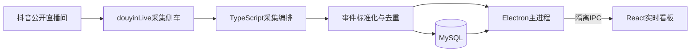

# 抖音直播实时数据看板

面向Windows的抖音公开直播间实时采集与运营看板。输入房间号即可查看在线趋势、互动速率、礼物、弹幕、用户事件、问题队列和行动提示，并将本次会话数据持久化到MySQL。

> 当前版本：`v0.1.0 MVP`。项目依赖抖音网页版非公开协议，适合个人研究、直播复盘和本地数据分析，不保证协议长期稳定。

## 核心能力

| 模块 | 能力 |
| --- | --- |
| 实时采集 | 弹幕、进场、点赞、礼物、关注、分享、粉丝团、在线序列和房间统计 |
| 指标看板 | 当前在线、进场、弹幕、点赞、礼物、独立用户及每分钟速率 |
| 在线趋势 | 完整分钟更新、最近15分钟滚动窗口、礼物高峰、问题激增和在线下降标记 |
| 运营辅助 | 直播态势评分、九维权重设置、问题分类、行动提示和高价值事件流 |
| 用户分析 | 用户等级筛选、发言榜、送礼榜、粉丝团榜、高等级用户进场 |
| 数据管理 | MySQL持久化、平台消息ID去重、历史会话恢复和本次会话CSV导出 |
| 隐私保护 | 原始用户标识使用SHA-256哈希，Cookie、数据库密码和token不写入仓库 |

## 看板说明

主界面按照直播运营工作台设计，所有模块在单屏内联动：

- 顶部输入房间号，显示直播标题、采集状态、连接时长、重连次数和最后更新时间。
- 六个核心指标展示本场累计值、每分钟速率和迷你趋势。
- 在线人数趋势每分钟更新一次，最多显示最近15分钟。
- 实时弹幕、高价值事件、问题队列、行动提示和榜单均支持滚轮浏览。
- 顶部等级筛选会统一影响互动指标、事件、问题、提示和榜单；当前在线人数属于房间级数据，不按用户等级拆分。
- 停止采集即结束本次会话，可导出本场CSV数据。

### 趋势事件口径

| 标签 | 判定条件 |
| --- | --- |
| 礼物高峰 | 本分钟不少于5件礼物，并达到前3分钟均值的2倍 |
| 弹幕问题激增 | 本分钟不少于3条问题弹幕，并达到前3分钟均值的2倍 |
| 在线下降 | 较上一分钟减少至少20人，并且降幅达到5% |

同类型事件至少间隔2分钟。标签生成后固定在对应分钟，直到随15分钟窗口移出。悬停竖线可查看该分钟的在线人数和触发指标。

## 技术架构



- 桌面端：Electron、React、ECharts、TypeScript
- 数据层：MySQL 8.0、批量写入、会话级聚合
- 采集层：可替换侧车进程，与UI和存储模型解耦
- 安全设置：`contextIsolation`开启，`nodeIntegration`关闭，渲染进程只使用白名单IPC

## 使用便携版

### 系统要求

- Windows 10或Windows 11，x64
- MySQL 8.0
- 可访问目标抖音公开直播间的网络环境

### 1．下载软件

从GitHub Releases下载：

```text
DouyinLiveDashboard-0.1.0-x64.exe
```

便携版未使用商业代码签名证书，Windows可能显示SmartScreen提示。

### 2．配置数据库

在当前Windows用户目录创建`.my.cnf`：

```ini
[client]
host=127.0.0.1
port=3306
user=你的数据库用户
password=你的数据库密码
```

程序只操作项目库`douyin_live_dashboard`。首次使用源码运行时执行初始化命令创建项目表。

### 3．开始采集

1. 启动软件。
2. 输入抖音直播间房间号，或使用粘贴按钮从完整直播间链接提取房间号。
3. 点击开始。
4. 点击停止结束本次会话。
5. 点击导出保存本场CSV数据。

## 礼物采集与可选登录态

匿名连接能否收到礼物消息取决于抖音当前协议和直播间风控。需要登录态时，可在本机`.env.local`配置：

```dotenv
DOUYIN_COOKIE_B64=<Base64URL编码后的Cookie>
```

- 源码运行：将`.env.local`放在项目根目录。
- 便携版：将`.env.local`放在EXE同目录。
- CLI在项目根目录找不到`.env.local`时，会回退读取`release/.env.local`。

Base64URL只是编码，不是加密。Cookie不要发到聊天、截图、日志或Git提交中；使用完毕后应及时失效或轮换。

## 源码开发

### 安装与初始化

```powershell
npm install
npm run collector:install
npm run dev -- init-db
npm run desktop:dev
```

### 常用命令

```powershell
# 命令行采集
npm run dev -- monitor 房间号
npm run dev -- monitor https://live.douyin.com/房间号 --duration=90

# 查询与匿名审计
npm run dev -- last-session
npm run audit:session -- 房间号

# 验证
npm run typecheck
npm test
npm run test:db
npm run desktop:build

# 生成Windows便携版
npm run desktop:package
```

`audit:session`只输出会话级匿名聚合统计，不输出昵称或弹幕正文。

## 数据存储

项目使用以下数据表：

- `schema_migrations`
- `live_rooms`
- `monitoring_sessions`
- `interaction_events`
- `connection_intervals`

互动事件保留`collector_version`、`raw_method`和标准化`metrics_json`，用于协议升级和采集异常排查。时间统一存储为UTC，界面按本地时区显示。

## 已完成验证

- 125分钟持续采集，入库35,637条弹幕。
- 平台消息ID无重复，用户标识全部哈希化。
- 每分钟均有数据，最大消息间隔4.004秒。
- 礼物登录态联调120秒，入库2,241条事件，其中631条礼物消息、289位送礼用户。
- 当前自动化测试为7个测试文件、24项测试。
- TypeScript类型检查、数据库冒烟、Electron生产构建和桌面界面冒烟均已执行。

## 已知限制

- 采集依赖抖音网页版非公开协议，签名、风控或Protobuf字段变化后可能需要更新采集侧车和解析映射。
- 不承诺零丢失；网络波动、下播、登录失效和平台限流均可能造成数据缺口。
- 当前问题队列使用本地关键词规则，不是大模型语义分析。
- MVP同一时间只监控一个直播间。
- 便携版尚未配置应用图标和商业代码签名。
- 当前Windows构建为兼容本地符号链接权限，使用无ASAR打包。

## 使用边界

本项目只面向公开直播间，不绕过登录、验证码或访问控制，不提供批量账号、自动评论或自动互动功能。使用者需要自行确认当地法律、平台规则和数据处理要求。

## 项目文档

- [产品结构](docs/pm-20260714-douyin-live-dashboard-structure.md)
- [UI原型](docs/ui-prototypes/dashboard-v2.html)
- [第三方组件说明](vendor/douyinlive/THIRD_PARTY_NOTICE.txt)
- [开发工作记录](WORKLOG.md)
- [项目规范](AGENTS.md)

## 第三方组件

采集侧车基于`douyinLive v2.0.24`，其许可证和第三方声明保存在`vendor/douyinlive/`。本仓库尚未设置项目级开源许可证，发布源代码不等同于授予额外使用许可。
