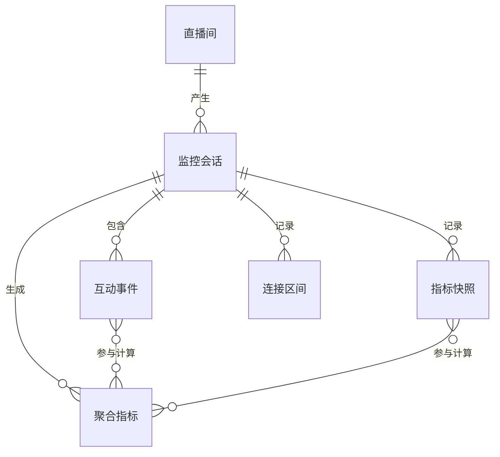

# 抖音直播实时弹幕与数据看板产品结构

状态：产品骨架已确认，MVP实现中

## 1. 核心场景

本地操作者在Windows电脑上输入任意公开抖音直播间URL，程序连接单个直播间，实时获取互动事件并写入本机MySQL，同时展示实时弹幕和本场直播数据看板

### MVP边界

- 单机、单用户
- 同一时间只监控一个直播间
- 首版优先保证聊天弹幕，礼物、点赞、进场、关注和房间状态按采集协议能力逐步接入
- 数据落在本机MySQL
- 不做云端同步、多房间并发、自动评论和自动互动
- 不绕过登录、验证码或平台访问控制

## 2. 核心对象清单

| 对象 | 定义 | 层级 |
|---|---|---|
| 直播间 | 公开抖音直播房间及其主播、标题和平台状态 | 核心 |
| 监控会话 | 操作者从开始采集到停止采集的一次本地记录过程 | 核心 |
| 互动事件 | 弹幕、礼物、点赞、进场、关注等统一事件 | 核心 |
| 指标快照 | 在线人数、累计观看、累计点赞等随时间变化的数据点 | 核心 |
| 连接区间 | 连接、重连、断流和恢复形成的时间区间 | 核心 |
| 聚合指标 | 基于互动事件和快照计算的实时统计结果 | 辅助 |
| 应用配置 | 本地数据库、代理、数据保留和界面偏好 | 辅助 |

已确认约束：同一时间只监控一个直播间

## 3. 对象CSMA

### 直播间

- 核心属性：房间ID、直播间URL、主播标识、主播昵称、标题、封面、开播时间
- 状态：解析中、直播中、已关播、访问受限、无法解析
- 元信息：数据来源、最后发现时间、采集器版本
- 行为：解析、连接、刷新状态、查看历史会话

### 监控会话

- 核心属性：会话ID、房间ID、开始时间、结束时间、停止原因、事件数量
- 状态：创建中、连接中、采集中、重连中、停止中、已完成、失败
- 元信息：应用版本、采集器版本、完整性状态
- 行为：开始、停止、重试、查看、导出

### 互动事件

- 核心属性：事件ID、平台消息ID、会话ID、事件类型、用户标识哈希、昵称、内容、平台时间、接收时间
- 状态：已接收、已解析、已入库、重复、解析失败
- 元信息：原始消息类型、协议版本、采集器版本
- 行为：查看、搜索、筛选、排序、导出

### 指标快照

- 核心属性：会话ID、时间点、在线人数、累计观看、累计点赞
- 状态：完整、部分字段缺失、无效
- 元信息：消息来源、协议版本
- 行为：绘制趋势、按时间范围查询

### 连接区间

- 核心属性：会话ID、开始时间、结束时间、连接状态、断开原因、重连次数
- 状态：建连中、正常、断流、已关闭
- 元信息：错误码、客户端版本、网络诊断信息
- 行为：查看连接历史、计算断流时长、定位数据缺口

### 聚合指标

- 核心属性：会话ID、指标名、统计窗口、统计维度、指标值
- 状态：计算中、当前值、已结算、失效
- 元信息：聚合版本、最后更新时间
- 行为：展示、排序、趋势对比

### 应用配置

- 核心属性：数据库主机、端口、库名、用户名、凭据引用、代理模式、数据保留期限、界面偏好
- 状态：未配置、验证中、有效、无效
- 元信息：配置版本、更新时间
- 行为：测试连接、保存、恢复默认

已确认项目数据库名：`douyin_live_dashboard`

已确认首版看板指标：连接状态、断流时长、重连次数、监控时长、累计弹幕数、独立发言人数、最近1分钟弹幕速度、每分钟弹幕趋势、活跃发言用户排行、最新弹幕列表；在线人数、点赞和礼物数据在协议能稳定获取时显示

## 4. 对象关联关系

| 主对象 | 从对象 | 关系 | 说明 |
|---|---|---|---|
| 直播间 | 监控会话 | 一对多 | 同一直播间可被多次监控，每次开始、停止形成独立会话 |
| 监控会话 | 互动事件 | 一对多、强从属 | 弹幕等事件必须属于一个会话，不能脱离会话独立存在 |
| 监控会话 | 指标快照 | 一对多、强从属 | 在线人数、点赞量等时序数据按会话保存 |
| 监控会话 | 连接区间 | 一对多、强从属 | 首次连接、断流、重连和恢复分别形成连接区间 |
| 监控会话 | 聚合指标 | 一对多、强从属 | 每场会话拥有自己的当前指标和最终结算指标 |
| 互动事件 | 聚合指标 | 计算依赖 | 弹幕量、独立发言人数、弹幕速度、活跃用户排行由事件计算，不建中间关系表 |
| 指标快照 | 聚合指标 | 计算依赖 | 在线人数、点赞趋势等由快照计算，不建中间关系表 |
| 应用配置 | 其他对象 | 无直接外键 | 配置是本机单例，监控会话只保存启动时的必要配置快照，避免配置修改影响历史记录 |

关联规则：

- `room_id`标识平台直播间，同一房间重复连接时复用直播间记录
- 每次开始监控都创建新的`session_id`
- 事件、快照、连接区间和聚合指标统一以`session_id`作为查询边界
- 聚合指标属于派生数据，可根据原始事件和快照重新计算
- 应用配置不直接关联历史数据，监控会话保存应用版本、采集器版本和必要配置摘要
- 房间、会话默认不物理删除，后续通过归档或数据保留策略清理从属数据
- 首版不拆分主播为独立对象，主播信息作为直播间属性保存

## 5. 页面结构

### MVP阶段

- 暂不实现桌面UI
- 先通过CLI打通直播间连接、弹幕实时输出、MySQL入库、停止监控和错误反馈
- UI开发不得阻塞采集链路和存储验证

### 后续监控工作台

- 视觉和信息布局参考工作区文件`抖音直播实时看板UI参考.jpg`
- 保留顶部房间信息、采集状态、连接时长、重连次数和最后更新时间
- 主工作区包含实时趋势、实时弹幕、关键事件和用户排行
- 直播态势评分、问题队列和行动提示需要额外分析规则，不进入首版MVP
- UI只消费领域服务提供的标准事件和聚合指标，不直接依赖采集协议对象

## 6. 数据模型草案

### `schema_migrations`

| 字段 | 类型 | 说明 |
|---|---|---|
| `version` | INT UNSIGNED | 迁移版本主键 |
| `applied_at` | DATETIME(3) | UTC应用时间 |

### `live_rooms`

| 字段 | 类型 | 说明 |
|---|---|---|
| `id` | BIGINT UNSIGNED | 本地主键 |
| `platform_room_id` | VARCHAR(64) | 抖音房间标识，唯一 |
| `room_url` | VARCHAR(2048) | 用户输入的直播间链接 |
| `anchor_id_hash` | CHAR(64) | 哈希化主播标识 |
| `anchor_nickname` | VARCHAR(255) | 主播昵称 |
| `title` | VARCHAR(512) | 直播标题 |
| `status` | VARCHAR(32) | 房间状态 |
| `created_at`、`updated_at` | DATETIME(3) | UTC时间 |

### `monitoring_sessions`

| 字段 | 类型 | 说明 |
|---|---|---|
| `id` | CHAR(36) | 会话UUID主键 |
| `room_id` | BIGINT UNSIGNED | 关联直播间 |
| `status` | VARCHAR(32) | 连接中、采集中、等待、完成、失败 |
| `started_at`、`ended_at` | DATETIME(3) | 会话时间范围 |
| `stop_reason` | VARCHAR(64) | 停止原因 |
| `collector_version` | VARCHAR(64) | 采集侧车版本 |
| `event_count` | BIGINT UNSIGNED | 去重后事件数 |
| `integrity_status` | VARCHAR(32) | 数据完整性状态 |
| `last_error` | TEXT | 最后错误，不含凭据 |

### `interaction_events`

| 字段 | 类型 | 说明 |
|---|---|---|
| `id` | BIGINT UNSIGNED | 本地主键 |
| `event_id` | CHAR(36) | 本地事件UUID |
| `platform_message_id` | VARCHAR(128) | 平台消息ID |
| `session_id` | CHAR(36) | 所属监控会话 |
| `room_id` | BIGINT UNSIGNED | 所属直播间 |
| `event_type` | VARCHAR(64) | MVP固定为`chat` |
| `event_time`、`received_at` | DATETIME(3) | 平台时间和本机接收时间 |
| `user_id_hash` | CHAR(64) | 哈希化用户标识 |
| `nickname` | VARCHAR(255) | 用户昵称 |
| `content` | TEXT | 弹幕内容 |
| `raw_method` | VARCHAR(128) | 原协议消息类型 |
| `collector_version` | VARCHAR(64) | 采集侧车版本 |
| `payload_json` | JSON | 标准化前载荷，后续设置保留期限 |

去重键：`session_id + platform_message_id`

### `connection_intervals`

| 字段 | 类型 | 说明 |
|---|---|---|
| `id` | BIGINT UNSIGNED | 本地主键 |
| `session_id` | CHAR(36) | 所属监控会话 |
| `status` | VARCHAR(32) | 连接中、已连接、断流 |
| `started_at`、`ended_at` | DATETIME(3) | 区间范围 |
| `close_code` | INT | WebSocket关闭码 |
| `reason` | VARCHAR(512) | 关闭或断流原因 |
| `reconnect_attempt` | INT UNSIGNED | 重连次数 |

所有表仅创建在项目库`douyin_live_dashboard`，初始化器拒绝其他库名

## 7. 开发阶段与验收门

### M0 工程和数据库，已完成

- TypeScript CLI可构建
- 项目库和5张MVP表可初始化
- 侧车可在Windows本地启动
- 数据库保护、配置解析、事件标准化和侧车客户端有自动化测试

### M1 单房间真实弹幕，端到端链路已通过

- 输入房间号或直播链接
- 实时输出聊天弹幕
- 去重后批量写入MySQL
- `Ctrl+C`停止并正确结算会话
- 连续运行30分钟无进程崩溃

2026-07-15真实联调结果：公开直播间`557481980778`运行89秒，入库181条聊天弹幕，181个不同平台消息ID，用户标识哈希无缺失和异常。30分钟稳定性测试留到下一验收门

### M2 稳定性验证

- 覆盖低流量和中流量直播间
- 连续运行2小时
- 抽样核对聊天召回率
- 验证断网恢复、房间下播和签名失效状态

### M3 扩展事件和指标

- 礼物、点赞、进场、关注
- 指标快照和聚合指标
- 数据保留和原始载荷清理

### M4 Windows监控工作台

- 按参考图实现实时弹幕、趋势和排行
- UI只依赖领域服务，不依赖原始Protobuf对象
- 态势评分、问题队列和行动提示另行定义分析规则

## 8. 待确认项

- 暂无
